# PoisonFlix — Live App Walkthrough (Ground Truth for Web Port)

This document is a visual, screen-by-screen inventory of the live **PoisonFlix** Android TV app (package `com.hy300.poisonflix`), captured directly on a running emulator so nothing gets missed when porting the UI to the web app at `poisonflix-web`. It complements the static code map: everything here (loading states, exact copy, focus/highlight behavior, transitions, bugs) was observed by actually driving the app with a D-pad, not read from source.

- **Date:** 2026-07-12
- **Device:** Android TV emulator, AVD `poisonflix_tv`, device id `emulator-5554`
- **Backend:** Jellyfin at `http://192.168.1.61:8096` (healthy); Jellyseerr (request/"Pedir" flows) on the same host
- **Session state:** the app launched directly into an already-authenticated Home screen — **no login screen was encountered** at any point in this walkthrough (see Summary)

---

## 1. Cold start — Home loading state

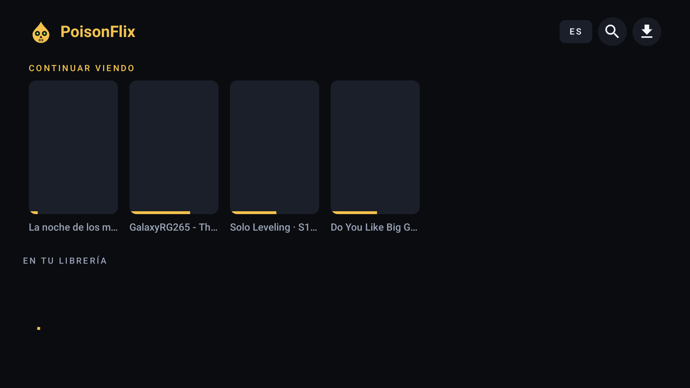

- Captured immediately after a fresh `am start` of `MainActivity`.
- The **"CONTINUAR VIENDO"** row title is already rendered, but the poster images underneath are not loaded yet: each card is a dark navy placeholder rectangle with a thin amber/gold line at the bottom edge.
- That amber line is **not a generic loading shimmer** — it's the same progress bar used later to show watch progress; it renders before the poster image itself is available.
- Row below ("EN TU LIBRERÍA") has its header text visible but zero content yet — a small stray yellow dot fragment is visible near the bottom-left, a leftover render artifact from the row that hasn't laid out yet.
- No skeleton/shimmer animation was observed — just blank placeholders that pop in once the network image finishes loading.

## 2. Home — top, fully loaded

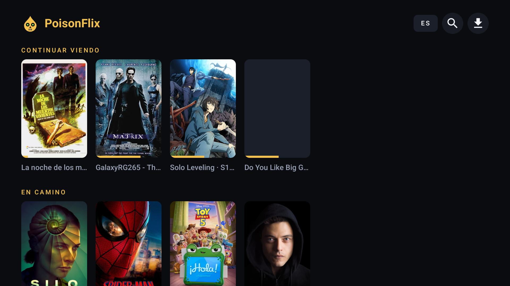

- Top bar (persistent across all Home scroll positions): skull/poison-drop emoji logo + **"PoisonFlix"** wordmark in amber, then right-aligned: a language pill button (**"ES"**), a circular search (magnifying glass) icon, a circular downloads-tray icon.
- **Row 1 — "CONTINUAR VIENDO"** (Continue watching): 4 cards — "La noche de los muertos vivientes", **"GalaxyRG265 - The.Matrix.1999.1080p.BluRay.DDP5.1.x265.10bit-GalaxyRG265"** (a raw scene-release/torrent filename used verbatim as the display title — not cleaned up), "Solo Leveling · S1…", **"Do You Like Big Girls · S1·E2"** (an ecchi-flavored anime title, sitting in the mainstream Continue Watching row, not gated behind +18). Every card has a thin amber progress bar under the poster showing watch progress.
- **Row 2 — "EN CAMINO"** (lit. "on the way" — this is the *downloading* row; note it is **not** labeled "Descargando" as one might assume): Silo, Spider-Man: Un nuevo día, Toy Story 5, Mr. Robot. Each card carries its own status badge (see next screenshot) — verbatim strings seen: **"PARCIALMENTE DISPONIBLE"** (visually truncated to "PARCIALMENTE" on the card) and **"DESCARGANDO"**.
- No element appears focused/highlighted at this point — default focus is **not** set until the first D-pad key event is received (confirmed via `uiautomator dump`: no `focused="true"` node exists right after launch).

## 3. Home — focus/highlight style

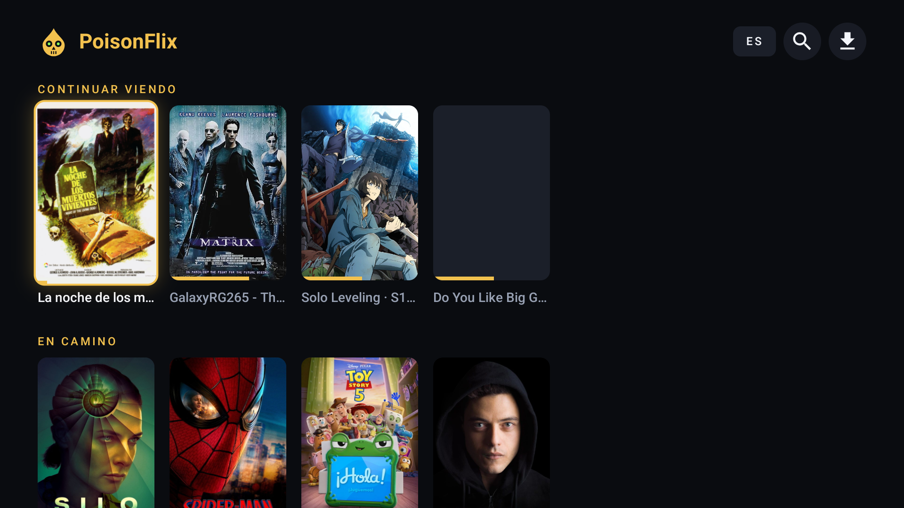

- After the first D-pad press (DOWN), focus lands on the **first card of Continuar viendo**.
- Focus style used everywhere in the app: a solid rounded-rectangle **amber/gold glow border** around the focused card, and its title label switches from gray to **bold white**. Non-focused titles are medium-gray.
- This is the only focus affordance in the app — no scale/zoom animation was observed on focus change, just the border + text-weight/color swap.

## 4. Home — library row + Trending/Discover

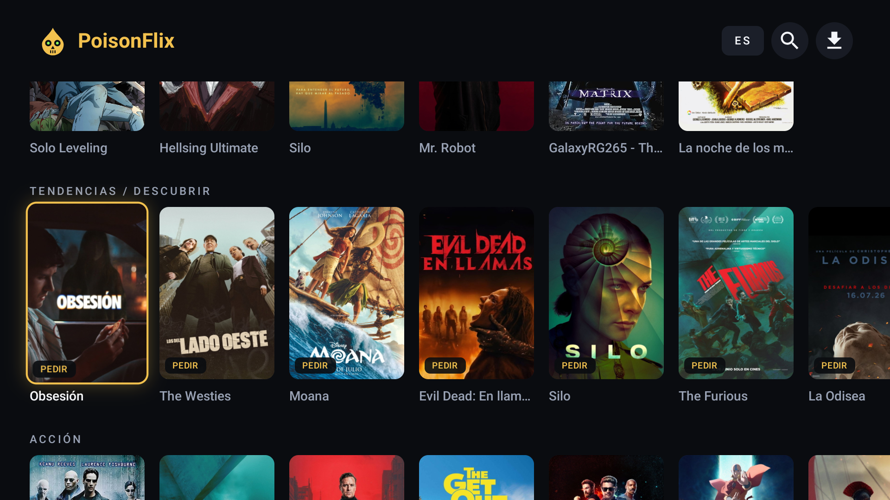

- Tail of **"EN TU LIBRERÍA"** (Your Library — not "Tu biblioteca" as one might assume): Solo Leveling, Hellsing Ultimate, Silo, Mr. Robot, GalaxyRG265 (Matrix), La noche de los muertos vivientes.
- **"TENDENCIAS / DESCUBRIR"** — Trending and Discover are merged into a **single row**, not two separate rows. Items not yet in the library show a black **"PEDIR"** (Request) pill badge bottom-left (this is the Jellyseerr request affordance). Focused card here uses a heavier/brighter amber glow than the thin border seen on Continue Watching cards.
- **"ACCIÓN"** genre row begins at the very bottom.

## 5. Home — Acción → Comedia → Terror

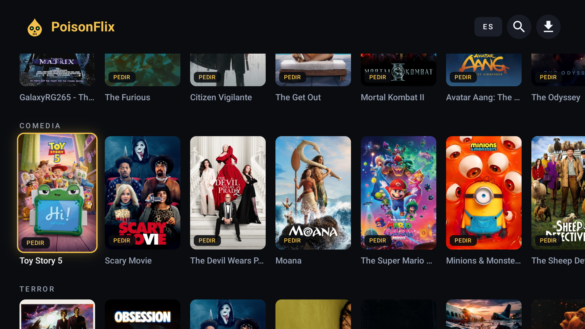

- Tail of "ACCIÓN", then **"COMEDIA"** row (Toy Story 5, Scary Movie, The Devil Wears Prada 2, Moana, The Super Mario Galaxy Movie, Minions & Monsters, The Sheep Detectives), then **"TERROR"** row starting.
- Confirms the "PEDIR" badge pattern repeats per-genre-row for any title not already owned.

## 6. Home — Terror → Ciencia ficción → Drama

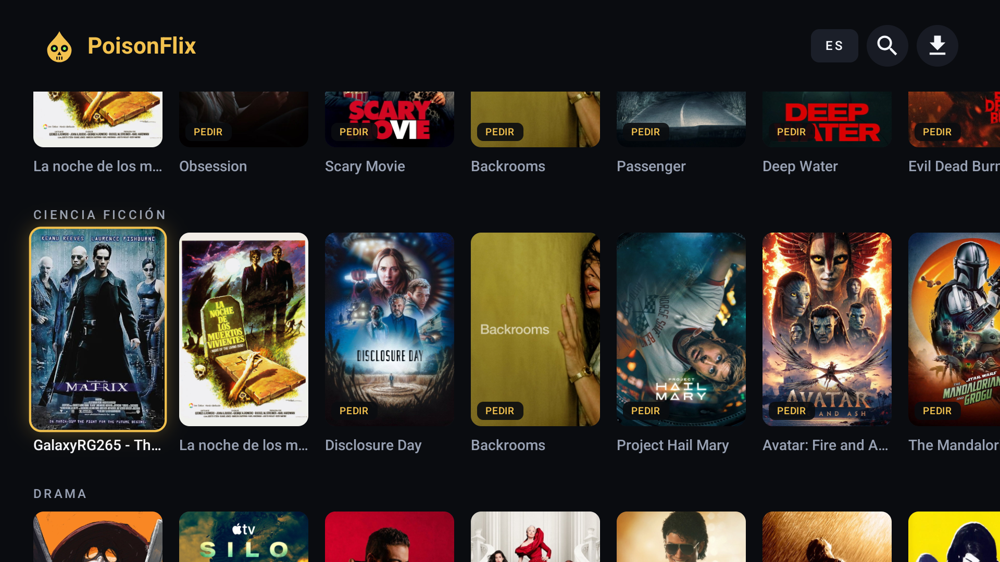

- Tail of "TERROR" (La noche de los m…, Obsession, Scary Movie, Backrooms, Passenger, Deep Water, Evil Dead Burn…), then **"CIENCIA FICCIÓN"** row, then **"DRAMA"** row starting.

## 7. Home — more genres, approaching +18

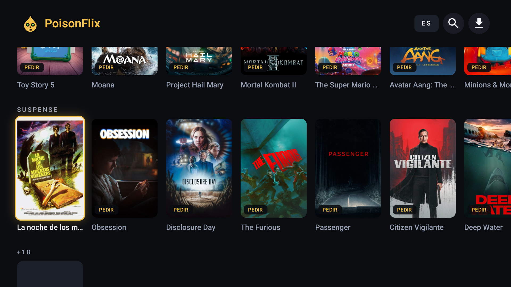

- This capture is further down the same scroll (after Animación, Crimen, Romance, Aventura were also observed passing by — see full genre list in Summary): tail of a genre row, then **"SUSPENSE"**, and the **"+18"** section label just starting to peek in at the very bottom edge of the screen.

## 8. Home — bottom of scroll, +18 locked gate

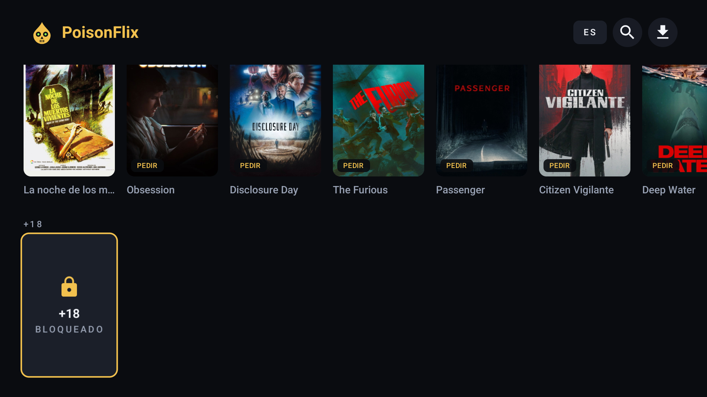

- This is the **last row of Home**: a single card (not a full row of posters) acting as a gate — amber padlock icon, **"+18"**, **"BLOQUEADO"** (Locked) label underneath. Focused state shows the same amber glow border as everywhere else.

## 9. +18 PIN gate

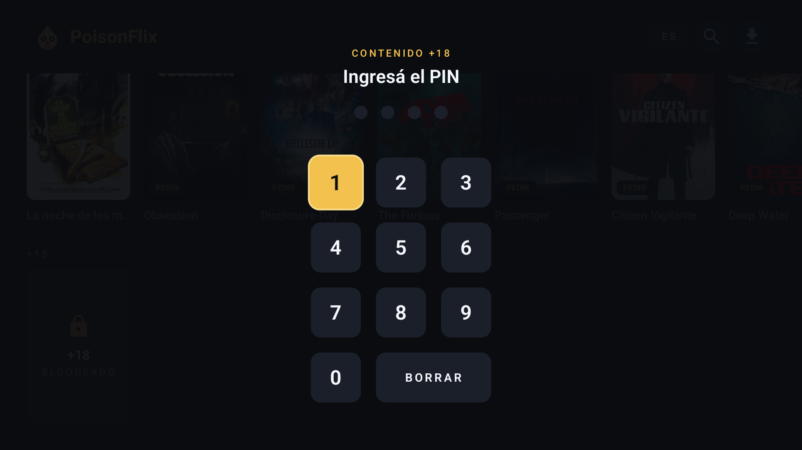

- Pressing OK on the locked +18 card opens a **modal overlay** on top of the (dimmed but still visible) Home screen behind it.
- Copy, verbatim: heading **"CONTENIDO +18"** (amber caps), subheading **"Ingresá el PIN"**.
- A 4-dot progress indicator (empty outlined circles) sits above the keypad.
- Custom on-screen numeric keypad: `1 2 3 / 4 5 6 / 7 8 9 / 0  BORRAR` (BORRAR = clear/delete). Default focus lands on **"1"**.
- No numeric hardware keypad is used — this is 100% D-pad-navigated, one digit selected + OK per key.

## 10. PIN accepted

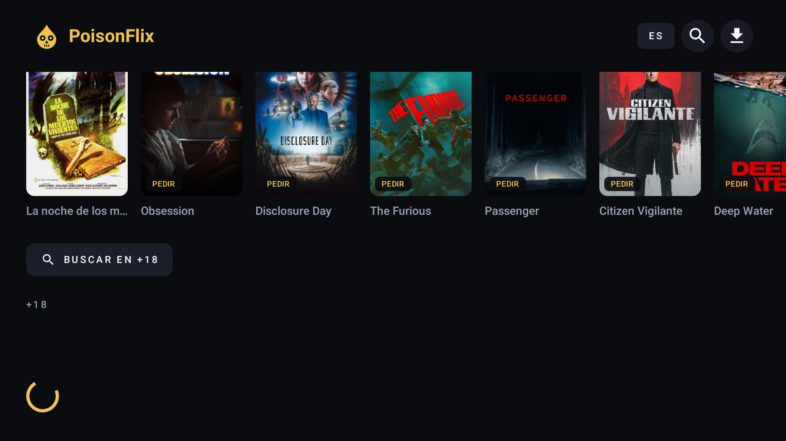

- PIN **6969** (as assumed in the test brief) was correct and worked on the first try.
- Immediately after the 4th digit, the keypad overlay disappears and a **"BUSCAR EN +18"** (Search within +18) pill button with a magnifying-glass icon appears where the keypad was.
- Below it, the "+18" section header is shown again (no longer "BLOQUEADO"), with its content area showing a **yellow circular loading spinner** — the unlocked content is fetched asynchronously *after* unlock, not pre-fetched while locked.

## 11. +18 section unlocked

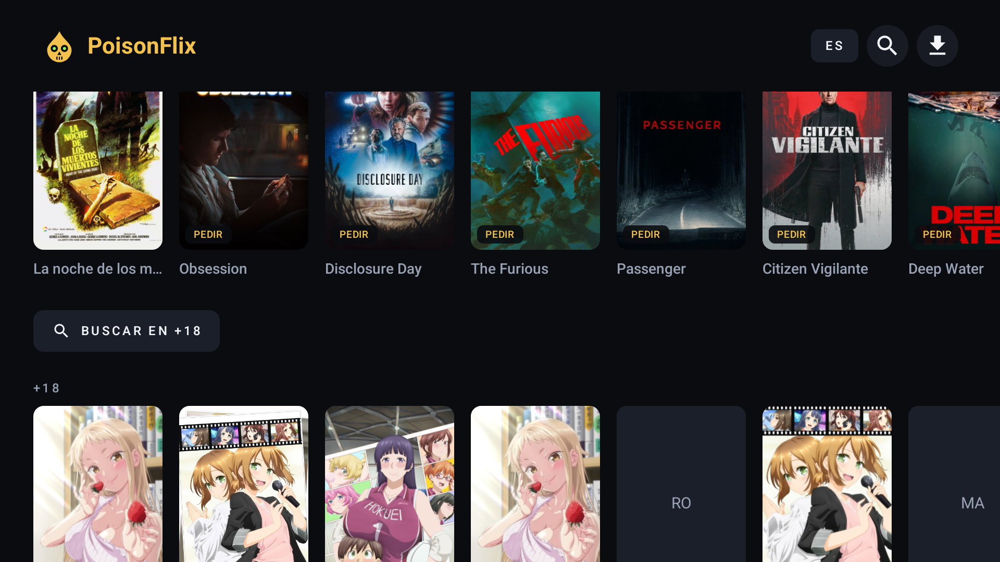

- A few seconds later the row populates with a horizontal shelf of adult-oriented anime covers under the plain **"+18"** header.
- The unlock persists for the rest of the app session — returning to this row later did not re-prompt for the PIN.

## 12. Search — empty/default state

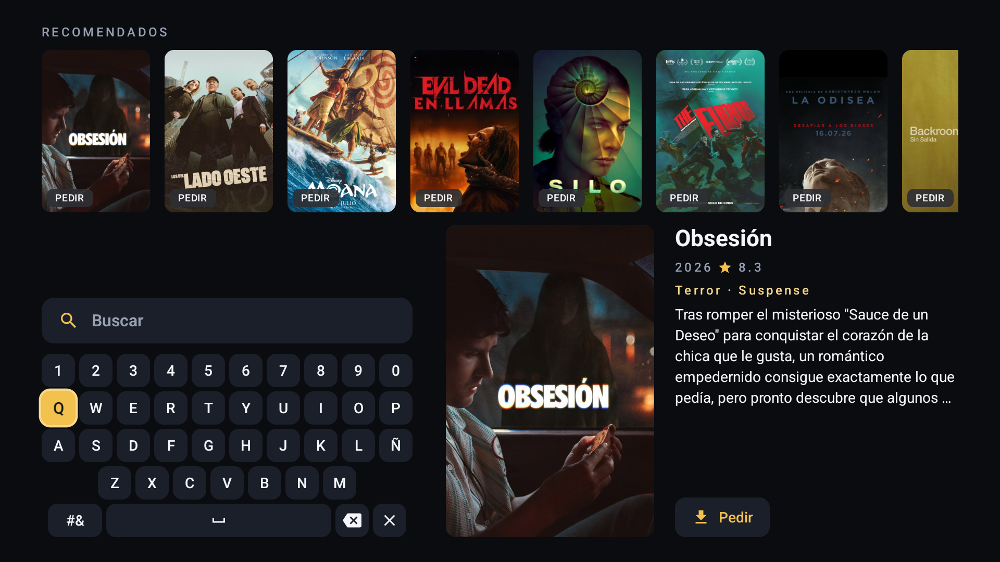

- Opened via the search icon in the top bar.
- Layout: a **"RECOMENDADOS"** row of suggested titles across the top (each with a "PEDIR" badge unless already owned), a search input pill with placeholder text **"Buscar"**, and a full custom on-screen **QWERTY keyboard** below it: rows `1234567890`, `QWERTYUIOP`, `ASDFGHJKLÑ`, `ZXCVBNM`, and a bottom row with a `#&` symbols-toggle key, a spacebar, a backspace key, and a circular "✕" close button.
- To the right, a **live preview panel** shows whatever recommended title is currently focused/highlighted in the top row: poster, title, year, star rating, genre tags, full synopsis, and a context-appropriate action button (**Pedir** for unowned titles, **Reproducir** for owned ones).
- Default focus on opening Search lands on the **"Q"** key.

## 13. Search — live results

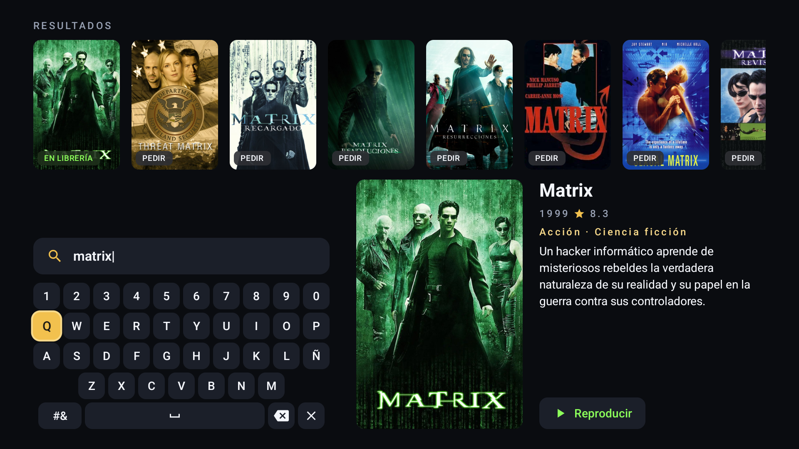

- Typed **"matrix"**. Results update live as you type (no explicit submit step needed) and the header switches from "RECOMENDADOS" to **"RESULTADOS"**.
- All Matrix-franchise entries returned; the already-owned 1999 film shows a green **"EN LIBRERÍA"** badge instead of "PEDIR".
- The preview panel auto-syncs to the first/highlighted result: "Matrix", 1999, ★ 8.3, "Acción · Ciencia ficción", full synopsis, and a **"Reproducir"** button (since it's already downloaded).
- Note: the on-screen keyboard's focus traversal is quirky — see Summary for the D-pad navigation gotchas discovered while testing this screen.

## 14. Downloads screen

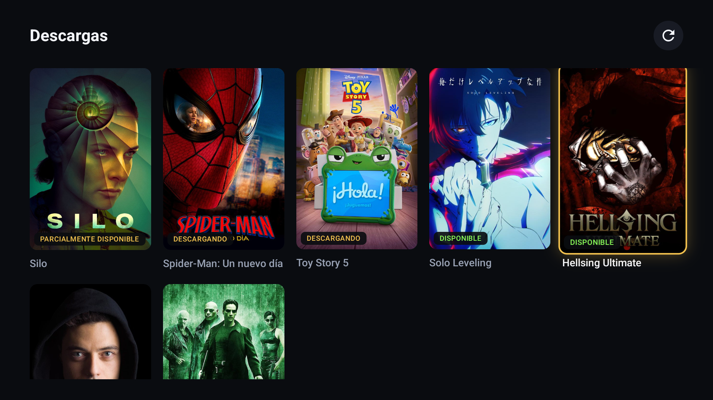

- Reached via the download-tray icon in the top bar — this is a **separate, dedicated screen**, distinct from the "EN CAMINO" row on Home.
- Header: **"Descargas"** with a circular refresh icon top-right.
- Grid of items, each with its own status badge: Silo — **"PARCIALMENTE DISPONIBLE"**; Spider-Man: Un nuevo día — **"DESCARGANDO"**; Toy Story 5 — **"DESCARGANDO"**; Solo Leveling — **"DISPONIBLE"**; Hellsing Ultimate — **"DISPONIBLE"** (focused). Mr. Robot and Matrix appear further down with no visible badge in this viewport (likely fully available, badge omitted once idle).

## 15. Movie Detail screen

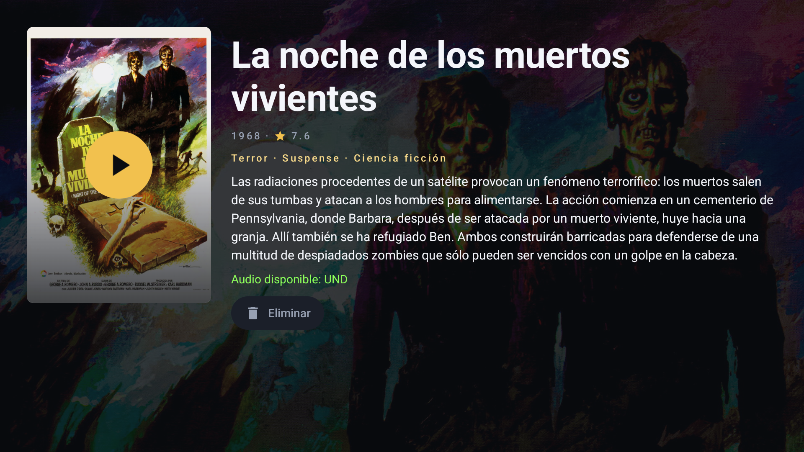

- "La noche de los muertos vivientes" (1968).
- Full-bleed blurred/darkened backdrop of the poster art fills the entire screen behind the content (ambient-background treatment).
- Left: poster with a large circular amber **Play button** overlay, shown on focus/hover.
- Right: title in large bold white type, **"1968 · ★ 7.6"**, genre tags **"Terror · Suspense · Ciencia ficción"**, full synopsis paragraph, and a green line **"Audio disponible: UND"** (available audio track language code).
- Because this title is already downloaded, the action button is **"Eliminar"** (Delete, trash-can icon) rather than Pedir/Reproducir.

## 16. Player — loading / transcoding state

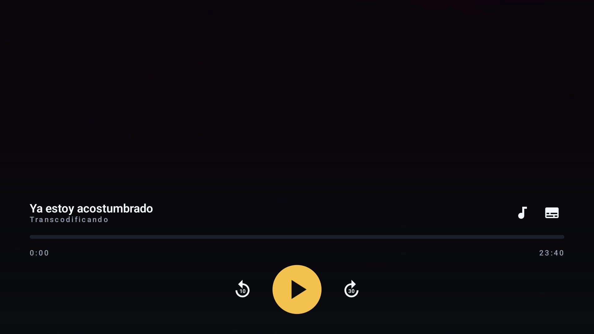

- Selecting an **in-progress** item from "Continuar viendo" (Solo Leveling) skips any detail screen and jumps straight into the Player to resume playback.
- Episode title **"Ya estoy acostumbrado"** with a status line reading **"Transcodificando"** (Transcoding) instead of a time value.
- Big amber circular Play button center-screen (video not yet started), rewind-10s and forward-30s round buttons flanking it, a progress bar reading "0:00" / "23:40", and top-right a music-note icon (audio track selector) and a subtitles/CC icon. Video frame is black while transcoding.

## 17. Player — paused, controls shown

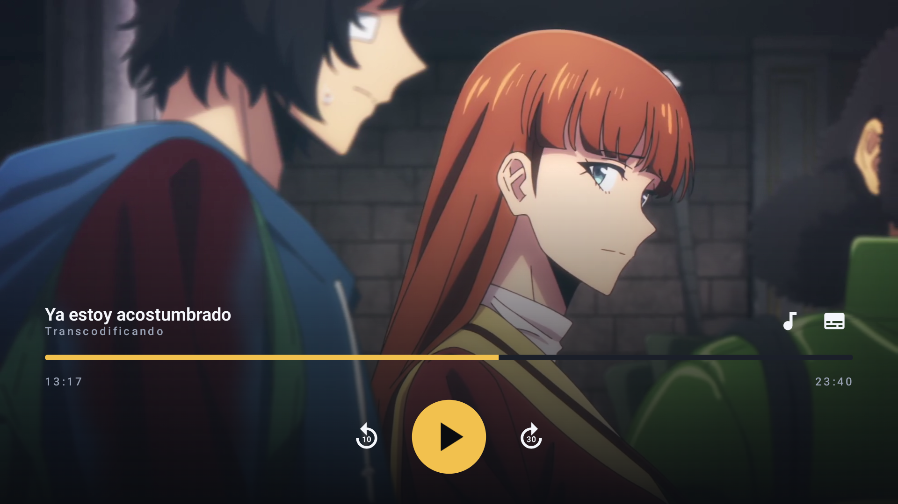

- Pressing OK mid-playback pauses the video and re-shows the same control overlay: progress bar now partially filled, time reads **"13:17"** / "23:40".
- Notably, the **"Transcodificando"** label is still displayed under the episode title even 13+ minutes into playback — this looks like a static/stale status string rather than one that updates once playback is actually underway (flagged as a likely copy/state bug).

## 18. Player — fullscreen, controls hidden

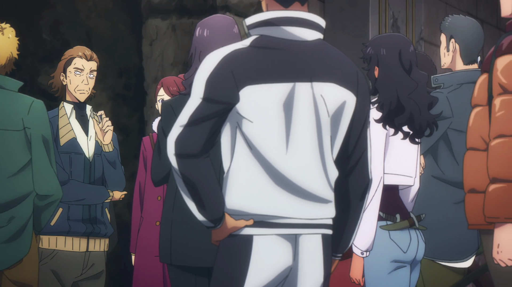

- A few seconds of inactivity and the entire control overlay auto-hides, leaving a clean fullscreen video with no chrome at all.

## 19. TV Series Detail — two-pane layout with episode list

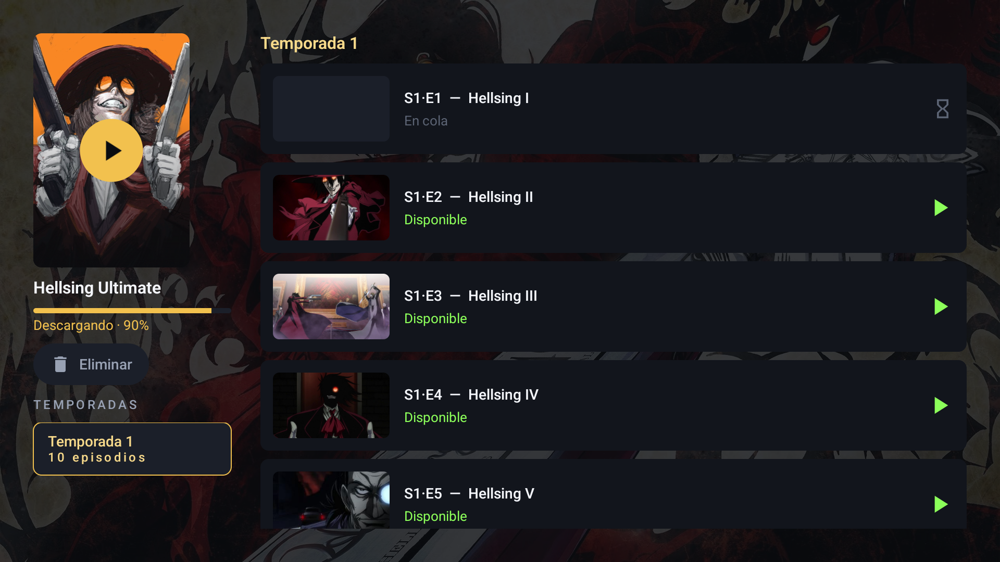

- "Hellsing Ultimate" — confirms the two-pane pattern requested for the port:
  - **Left pane** (narrower, fixed): poster with Play-button overlay, title, a horizontal download-progress bar, status text **"Descargando · 90%"**, an **"Eliminar"** action button, and a **"TEMPORADAS"** (Seasons) list — here a single selectable card: **"Temporada 1 / 10 episodios"** (focused, amber border).
  - **Right pane** (wider, independently scrollable): episode list under a **"Temporada 1"** header. Each row = thumbnail + **"S1·E# — Episode Title"** + status line: **"En cola"** (Queued — greyed out, hourglass icon, no thumbnail yet) for S1·E1, or **"Disponible"** (green text, green play-triangle icon, thumbnail loaded) for S1·E2 through E5+.

## 20. TV Series Detail — multiple seasons

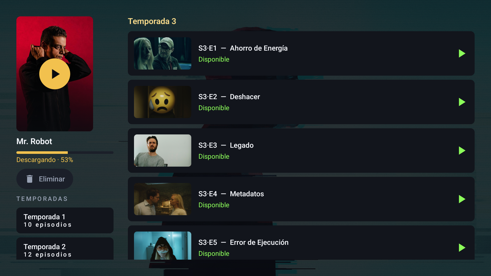

- "Mr. Robot" — same two-pane pattern, demonstrating multi-season support: the "TEMPORADAS" list on the left shows **"Temporada 1 · 10 episodios"**, **"Temporada 2 · 12 episodios"**, and the currently-active **"Temporada 3"** (whose episodes are shown in the right pane). Left pane shows **"Descargando · 53%"**.
- Right pane lists Season 3 episodes S3·E1 "Ahorro de Energía" through S3·E5 "Error de Ejecución", all **"Disponible"**.
- Curiosity: episode S3·E2 "Deshacer" has no real still — its thumbnail is a stylized worried-face emoji graphic, clearly placeholder/demo content rather than a real screenshot from the show.

## 21. Search — no-results / empty state

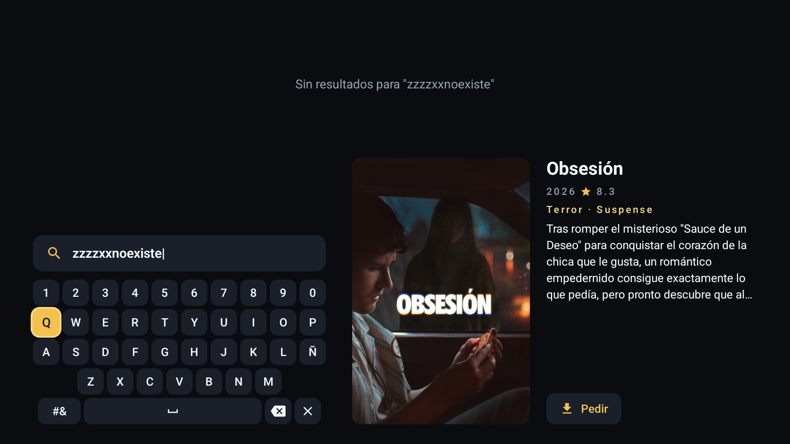

- Typed a nonsense query, **"zzzzxxnoexiste"**.
- Results area collapses to a single centered gray line: **'Sin resultados para "zzzzxxnoexiste"'** (verbatim, with the query echoed back in quotes).
- Bug/inconsistency: the right-side preview panel does **not** clear — it keeps showing the last/default recommended title ("Obsesión") with its "Pedir" button, even though there are zero matching results. Worth deciding deliberately for the web port whether the preview should hide or reset on empty results.

---

## Summary

**Total distinct screens/states captured: 21**

Screenshot files (in `walkthrough-shots/`, in the order visited):

1. `01-home-loading.png`
2. `02-home-top.png`
3. `03-home-focus-style.png`
4. `04-home-library.png`
5. `05-home-accion.png`
6. `06-home-terror.png`
7. `07-home-genres-mix.png`
8. `08-home-plus18.png`
9. `09-pin-gate.png`
10. `10-pin-result.png`
11. `11-plus18-unlocked.png`
12. `12-search-empty.png`
13. `13-search-results.png`
14. `14-downloads-screen.png`
15. `15-movie-detail.png`
16. `16-player-loading-transcoding.png`
17. `17-player-controls.png`
18. `18-player-playing-fullscreen.png`
19. `19-series-detail-episodes.png`
20. `20-series-detail-multiseason.png`
21. `21-search-empty-state.png`

### Full list of Home sections seen, verbatim, in scroll order

1. CONTINUAR VIENDO
2. EN CAMINO
3. EN TU LIBRERÍA
4. TENDENCIAS / DESCUBRIR
5. ACCIÓN
6. COMEDIA
7. TERROR
8. CIENCIA FICCIÓN
9. DRAMA
10. ANIMACIÓN
11. CRIMEN
12. ROMANCE
13. AVENTURA
14. SUSPENSE
15. +18 (locked gate, single card, not a shelf of posters)

That's **15 distinct sections** on Home — noticeably more than a "few genre rows" baseline expectation, since the catalog spreads across roughly 10 individual genre rows in addition to the functional rows (continue watching, downloading, library, trending, adult gate).

### Surprises / discrepancies vs. the test brief's assumptions

- **No login/onboarding screen at all.** The app launched directly into an authenticated Home screen; the session from a previous run was already persisted. Credentials (`perroenvenenado` / `pass1234`) were never needed and never tested.
- **PIN 6969 was correct**, as assumed, and unlocking persists for the rest of the session (no re-prompt on subsequent visits).
- **Row naming differs from assumptions:** the downloading row is **"EN CAMINO"**, not "Descargando"; the library row is **"EN TU LIBRERÍA"**, not "Tu biblioteca". Individual item badges *within* those rows do use "DESCARGANDO" / "PARCIALMENTE DISPONIBLE" / "DISPONIBLE".
- **Trending and Discover are one merged row** ("TENDENCIAS / DESCUBRIR"), not two separate ones.
- **No dedicated Settings/Profile/Logout screen exists anywhere in the app.** The only account-adjacent control is the "ES"/"EN" language toggle pill in the top bar. Tapping it flips its own label instantly, but the surrounding row/section titles stayed in Spanish right after toggling — the toggle may not be fully wired to actual localization, or requires a reload to propagate to content strings.
- **Selecting an in-progress "Continuar viendo" item skips the Detail screen** and drops straight into the Player to resume; only titles *without* watch progress open the Detail screen first.
- **Messy/unclean metadata:** at least one Continue Watching title displays a raw scene-release filename as its title (`GalaxyRG265 - The.Matrix.1999.1080p.BluRay.DDP5.1.x265.10bit-GalaxyRG265`), and an ecchi-flavored anime episode ("Do You Like Big Girls · S1·E2") appears in the mainstream Continue Watching row rather than being confined to the +18 section — worth deciding deliberately how the web port normalizes/filters titles like this.
- **A reproducible crash was hit during testing:** rapidly pressing D-pad UP several times in a row while scrolled through Home's rows triggered `java.lang.IllegalStateException: LayoutCoordinate operations are only valid when isAttached is true` inside Compose's focus/key-input dispatch (`androidx.compose.ui.focus.FocusOwnerImpl` / `AndroidComposeView.keyInputModifier`), force-closing the app. Reproduced once after: UP×10 → DOWN×6 → UP×3 in quick succession. Relaunching recovered cleanly. This is a native-app-only concern (Compose focus system), not something that translates to the web port, but documenting it in case the underlying UX (rapid repeated vertical scroll near row boundaries) needs equivalent handling on the web.
- **BACK-navigation asymmetry:** BACK from any Detail screen correctly returns to Home. BACK from the fullscreen **Player**, however, exits the entire app straight to the system launcher instead of returning to the previous screen — worth a deliberate decision for the web port (e.g., always return to the item's detail page or Home).
- **On-screen keyboard focus quirks (Search screen):** pressing UP while focus is inside the on-screen keyboard pops the entire Search overlay back to Home (Search behaves as an overlay/route on top of Home, not a separate stacked screen); on one occasion this chained further and exited straight to the system Android TV launcher instead of stopping at Home.
- **Touch/tap input is unreliable in this D-pad-first app** — `adb shell input tap` on a poster card sometimes did nothing or only shifted state without invoking navigation; D-pad + OK was the only fully reliable interaction method. Not applicable to the web port directly, but a reminder that the source app assumes remote/D-pad-only input, not touch/mouse.
- **No network retries were needed** — the Jellyfin/Jellyseerr backend responded normally throughout; the only "loading" states observed were the Home cold-start image placeholders, the +18 section's post-unlock spinner, and the Player's "Transcodificando" state.
- **Stale preview panel on empty search** (see screen 21) and a **static "Transcodificando" label that doesn't update once playback is underway** (see screens 16–17) are both worth flagging as bugs/inconsistencies in the source app rather than intentional behavior to replicate as-is.
